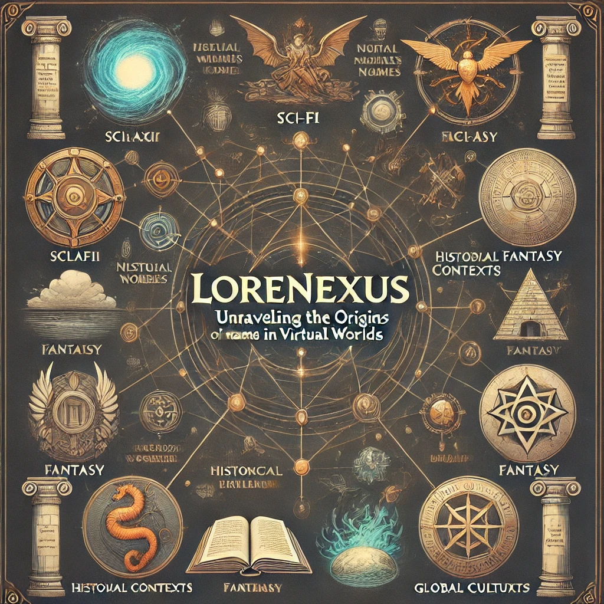
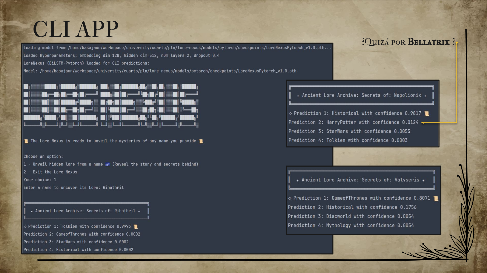
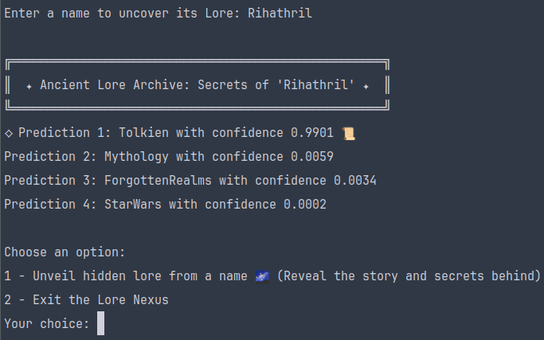
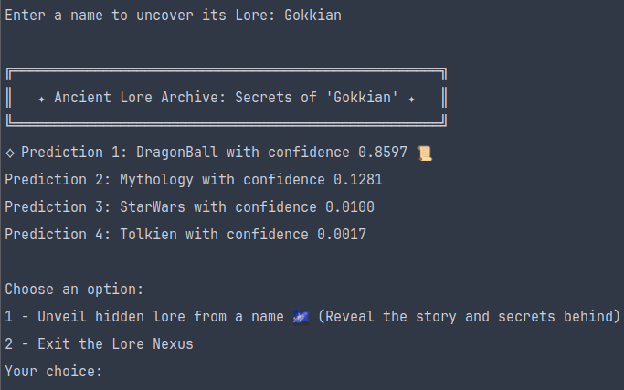
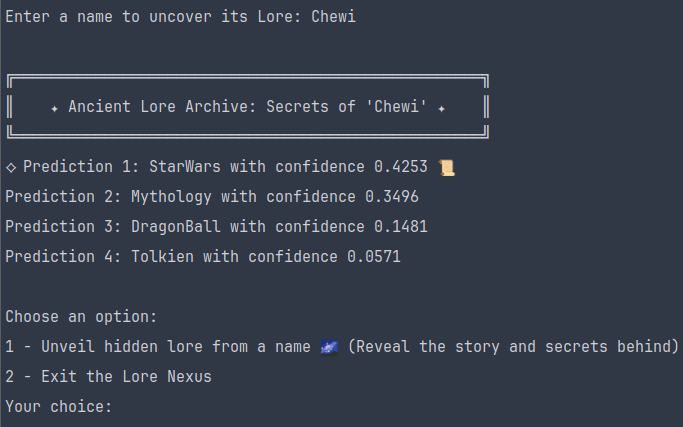
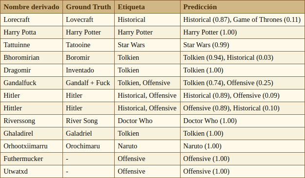

<div align="center">
  <h1>LoreNexus</h1>
</div>
<div align="center">
  
</div>


# Índice

1. [Sobre el proyecto](#sobre-el-proyecto)
2. [Presentación](#presentación)
3. [Instalación](#instalación)
4. [Uso del CLI](#uso-del-cli)
5. [Regeneración de datos](#regeneración-de-datos)
6. [Training Grounds](#training-grounds)
   - [Hiperparámetros y experimentos](#hiperparámetros-y-experimentos)
   - [Entrenar un modelo individualmente](#entrenar-un-modelo-individualmente)
7. [Guía de uso para la app con Docker (CLI)](#guía-de-uso-para-la-app-con-docker-cli)
8. [Universos disponibles en esta versión](#universos-disponibles-en-esta-versión)
9. [Ejemplos de predicciones](#ejemplos-de-predicciones)
   - [Tabla de inferencias](#tabla-de-inferencias)
10. [Agradecimientos](#agradecimientos)
11. [Sobre el autor](#sobre-el-autor)
12. [Licencia](#licencia)
---

## Sobre el proyecto
LoreNexus es una plataforma para extraer el universo de origen e influencias de nombres en videojuegos online, mediante detección de patrones fonéticos y morfológicos. Hace uso de modelos de lenguaje implementados con Pytorch "_from scratch_" (LSTMs bidireccionales o `BiLSTM` y tokenización a nivel de carácter), así como de diferentes técnicas de NLP tanto para la extracción y preprocesamiento de los datos como para la inferencia.

### Nota sobre el desarrollo

Este proyecto se da por finalizado en cuanto a la entrega, sin embargo hay algunas tareas que yo he decidido aún están pendientes. No obstante, planeo continuar el desarrollo de forma gradual, me ha encantado. Se pueden consultar el progreso de algunas tareas en el [proyecto de GitHub](https://github.com/users/geru-scotland/projects/5). Cualquier sugerencia o bug, por favor reportalo en el [Bug Tracker](https://github.com/geru-scotland/lore-nexus/issues).
## Presentación

La presentación del proyecto se puede encontrar aquí: [Presentación de LoreNexus](https://github.com/geru-scotland/lore-nexus/blob/development/doc/LoreNexus-presentacion.pdf)

Memoria en progreso.

---

## Instalación
Para instalar el proyecto y las dependencias, simplemente ejecuta los siguientes comandos:

```bash
git clone git@github.com:geru-scotland/lore-nexus.git
cd lore-nexus
pip install -r requirements.txt
export PYTHONPATH=$PYTHONPATH:$(pwd)
```

---

## Uso del CLI

Se dispone de una aplicación en `CLI` para poder realizar inferencias. Para ejecutarla, navega al modulo `app` y lanza `app.py`:

```bash
cd app/
python3 app.py
```

- Si el mejor modelo hasta el momento (`LoreNexusPytorch_v1.0.pth`) no se encuentra en el sistema, la app lo descarga automáticamente desde Hugging Face:
  [LoreNexusPytorch_v1.0](https://huggingface.co/basajaun-scotland/LoreNexusPytorch_v1.0/tree/main).

---

## Regeneración de datos

El dataset está disponible en `dataset/input`, pero se puede regenerar con  ejecutando `pipeline.py`, simplemente:

   ```bash
   cd pipeline
   python3 pipeline.py
   ```

- La configuración para la regeneración de datos se encuentra en `pipeline/config.json`.
- Los datos ya **estratificados** se guardan en `dataset/output` (ojo, se **sobreescriben** los datos existentes)
- También se crea un archivo `data_config.info` que contiene detalles sobre la configuración con la que se han generado los datos.

---

## Training Grounds

### Hiperparámetros y experimentos

Para explorar el espacio de hiperparámetros y entrenar modelos, ejecuta `hyperparameter_tuner.py` desde el directorio `training_grounds`:

```bash
cd training_grounds
python3 hyperparameter_tuner.py
```

- Si no se pasan argumentos, se lanzarán experimentos con **todos** los modelos que implementen la clase `LoreNexusWrapper`, actualmente:


  - `LoreNexusPytorch`
  - `LoreNexusFlair`


- Se le pueden pasar el modelo como argumento con `-m`, para que el sistema se limite a entrenar únicamente el especificado:

  - `-m pytorch`: Solo entrena el basado en PyTorch.
  - `-m flair`: Solo entrena el basado en Flair.


- Los conjuntos de hiperparámetros están definidos en `param_grids.json` y los logs se guardan en `training_grounds/logs`, donde se aglomeran por experimentos, llamados `arenas`. También se depositarán logs de cada modelo individualmente en `training_grounds/logs/`, con gráficas y otros detalles.

### Entrenar un modelo individualmente

Para entrenar un modelo específico:
1. Ve al archivo correspondiente:
   - `/models/pytorch/model.py`  
   - `/models/flair/model.py`
2. Descomenta las líneas al final del archivo, ajusta los hiperparámetros que desees y ejecutalo:

   ```bash
   python3 models/pytorch/model.py
   ```

   ó

   ```bash
   python3 models/flair/model.py
   ```
   
En ese caso los logs se guardan en `models/pytorch/logs` o `models/flair/logs` respectivamente, donde se pueden encontrar tanto logs exhaustivos, como gráficas con la evolución durante epochs, e incluso matrices de confusión.

   
No obstante, incluso para entrenamientos individuales, recomiendo usar `hyperparameter_tuner.py`.

---

# Guía de uso para la app con Docker (CLI)

Con Docker instalado ([Docker get-started](https://www.docker.com/get-started)): 


### 1. Pull de la imagen en el [registro de contenedores de github](https://github.com/geru-scotland/lore-nexus/pkgs/container/lore-nexus):
```bash
docker pull ghcr.io/geru-scotland/lore-nexus:latest
```

### 2. Y simplemente ejecutar el contenedor:
```bash
docker run -it ghcr.io/geru-scotland/lore-nexus:latest
```

**Nota**: Tengo pendiente la optimización de dependencias para reducir el tamaño de la imagen, ahora mismo ocupa mucho por `CUDA`, y no es necesario realmente al utilizar simplemente inferencias.

---

## Universos disponibles en esta versión

En ésta versión (modelo [LoreNexusPytorch_v1.0](https://huggingface.co/basajaun-scotland/LoreNexusPytorch_v1.0/tree/main)) se ha entrenado con los siguientes universos:

- **Harry Potter**
- **Star Wars**
- **Tolkien**
- **Warcraft**
- **Dragon Ball**
- **Naruto**
- **Forgotten Realms**
- **Final Fantasy**
- **Game of Thrones**
- **The Witcher**
- **Doctor Who**
- **Discworld**
- **Mythology**
- **Offensive**
- **Historical**

## Ejemplos de predicciones

<div align="center">
  
</div>

---

   <div align="center">
     
   </div>

   <div align="center">
     
   </div>

   <div align="center">
     
   </div>

   <div align="center">
     
   </div>

---

### Tabla de inferencias

<div align="center">
  
</div>

---

## Agradecimientos

Agradezco especialmente a **Oier López de Lacalle Lecuona** y  a **Itziar Aldabe Arregi** por su apoyo y guía durante el desarrollo de LoreNexus.


## Sobre el autor

Este proyecto fue desarrollado por **Aingeru García** como parte de un proyecto académico en la Universidad del País Vasco (UPV/EHU), asignatura de Procesamiento de Lenguaje Natural. 

Si tienes preguntas, comentarios o sugerencias, no dudes en contactarme:

- **GitHub**: [@geru-scotland](https://github.com/geru-scotland)
- **Email**: [aingeru.scotland@gmail.com](mailto:aingeru.scotland@gmail.com)

## Licencia

Este proyecto está licenciado bajo la [Licencia MIT](LICENSE). Esto significa que puedes usar, modificar y distribuir este software libremente, siempre que mantengas la atribución al autor original.

Para más detalles, consulta el archivo [LICENSE](LICENSE) en este repositorio.