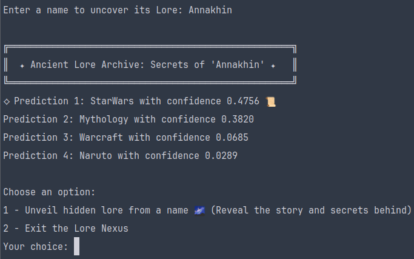

<div align="center">
  <h1>LoreNexus</h1>
</div>
<div align="center">
  
</div>


---
## Tabla de contenidos [WIP!]
1. [Visión general del pipeline de datos](#visión-general-del-pipeline-de-datos)
2. [Configuración](#configuracion)
3. [Componentes de pipeline](#componentes-del-pipeline)
   - [Data loaders y procesadores](#data-loaders-y-procesadores-de-datos)
      - [Wikidata Processor](#wikidata-processor)
      - [Mythdata Processor](#mythdata-processor)
   - [Data Processing](#data-processing)
      - [Data Augmentation](#data-augmentation)
      - [Data Stratification](#data-stratification)
4. [Extracción de Entidades (NER)](#extraccion-de-entidades-ner)
5. [Modelos](#modelos)
   - [Flair Model Wrapper](#flair-model-wrapper)
6. [Aplicación](#aplicación)
7. [Hyperparameter Tuner](#hyperparameter-tuner)

---

## Instrucciones de uso

Ejecutar esto en la terminal (TODO: Cambiar ruta antes de entregar proyecto):
```bash
export PYTHONPATH=$PYTHONPATH:/home/basajaun/workspace/university/cuarto/pln/lore-nexus/
```
## Visión general del pipeline de datos
La **Data pipeline de Lore Nexus** 
- **Data loaders/processors** 
- **Data Augmentation** 
- **Data stratification**

---

## Configuración
Se puede configurar mediante `config.json`, a modo de ejemplo:
```json
{
    "datasets": [
        {
            "name": "Wikidata",
            "path": "dataset/preprocessing/apis/wikidata",
            "input_folder": "raw_data",
            "output_folder": "processed_data",
            "dataset_file": "wikidata-universes.csv",
            "processed_file": "wikidata_dataset_FastText.txt"
        },
        {
            "name": "Mythdata",
            "path": "dataset/preprocessing/apis/mythology",
            "input_folder": "raw_data",
            "output_folder": "processed_data",
            "dataset_file": "myth_dataset.csv",
            "output_file": "myth_dataset.txt",
            "processed_file": "myth_dataset.txt"
        }
    ],
    "data_processor": {
        "path": "dataset/preprocessing",
        "output_folder": "output",
        "output_file": "dataset.txt",
        "train_file": "train.txt",
        "dev_file": "dev.txt",
        "test_file": "test.txt",
        "labels": [
            "HarryPotter", "StarWars", "Tolkien", "Warcraft",
            "DragonBall", "Naruto", "ForgottenRealms", 
            "FinalFantasy", "GameofThrones", "Mythology"
        ]
    }
}
```
---

## Componentes del pipeline

### Data Loaders y Procesadores de Datos

#### Wikidata Processor
- **Procesa datos** de la API de Wikidata, homogeiniza etiquetas y guarda datos formato FastText.
- **Homogenización de etiquetas** 
- **Normalización Unicode**

#### Mythdata Processor
- **Procesa dataset mitológico**, misma etiqueta para todos.
- **Normalización de texto** 

### Data Processing
La pipeline principal utiliza todos los datos preprocesados, pero el meollo aquí es tanto el data augmentation como la estratificación de los datos.

#### Data Augmentation
- **Aumentos** utilizo TextAttack, EXPLICAR LOS CASOS, el char swap, char insert etc. Randomizado en cuanto a num de chars y no a todas instancias
- **Aumentos personalizados** nombres con múltiples palabras, un factor que utilizo es el juntarlo, ya que muchos jugadores lo hace, por ejemplo "Arwen Undomiel" -> "Arwenundomiel". También separo todas las palabras y creo nuevas instancias con ellas, individualmente, para que el modelo les preste atención y "las conozca" más, que puede haber muchos casos diferentes. Obviamente misma etiqueta.
- Mitológicos no he aumentado aún, que se comen al resto del dataset si no

#### Data Stratification
- **Estratifica los datos**, es decir, la idea es mantener equilibrio entre los datos de train, val y test.

---

## Extracción de Entidades NER 
El **NER Corpus Builder** utilizo para extraer entidades de documentos (pdfs por ahora), utilizando un modelo preentrenado de **spaCy** ([RoBERTa](https://huggingface.co/docs/transformers/model_doc/roberta)).

Idea original era para aportar más a nombres, pero realmente no es necesario, utilizo principalmente para `[LOC] [GPE]`

---

## Modelos

### Flair Model Wrapper
**LoreNexusFlairModel** extiende **LoreNexusWrapper** para la clasificación de texto. Utilizo **Character Embeddings** y un **RNN LSTM** (bidireccional). Lo he subido a Hugging Face: [basajaun-scotland/lore-nexus-bilstm-flair](https://huggingface.co/basajaun-scotland/lore-nexus-bilstm-flair)
- **Training mode** 
- **CLI mode** inicializa una instancia del modelo para ser utilziada por la app y poder hacer predicciones en entradas del usuario de manera rápida, si no hay que levantar el modelo cuando se quiera hacer predicciones manualmente.

---

## Aplicación
La aplicación de **Lore Nexus** interfaz mediante CLI para predecir nombres - para pruebas rápidas. Algunos ejemplos curiosos:
---

---

---

---

--- 


---


## Modelos disponibles
- Flair: [Huggin Face: basajaun-scotland/lore-nexus-bilstm-flair](https://huggingface.co/basajaun-scotland/lore-nexus-bilstm-flair)
- LTSM
- CharacterBert

### Créditos y referencias
- Imagen hecha por ChatGPT